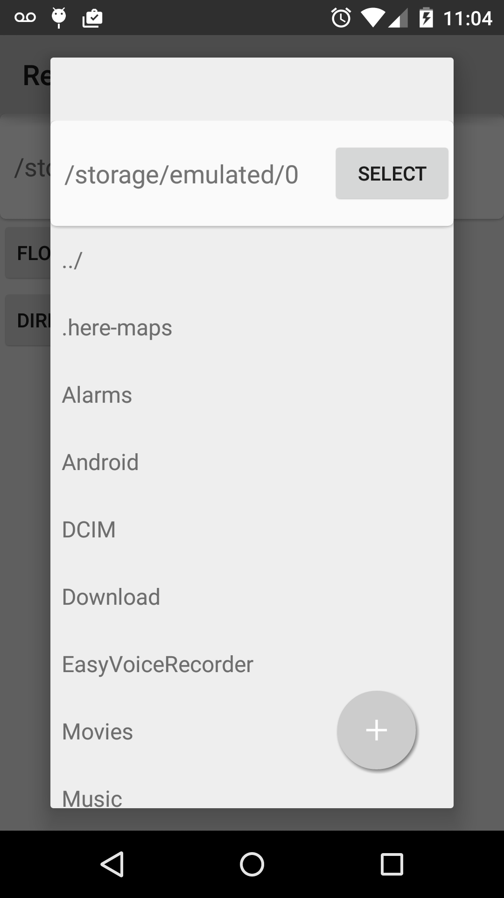

# Android ReactiveDirectoryChooser
[](https://travis-ci.org/TurhanOz/ReactiveDirectoryChooser)
[](http://search.maven.org/#search%7Cgav%7C1%7Cg%3A%22com.turhanoz.android%22%20AND%20a%3A%22reactivedirectorychooser%22)
[](http://android-arsenal.com/details/1/1699)
[](https://waffle.io/TurhanOz/ReactiveDirectoryChooser)

A simple android library that lets user select a directory.

This library has been developed using RxJava. It also integrates relevant unit tests.

<table>
<tr>
<th>Usual Fragment<br></th>
<th>Floating DialogFragment<br></th>
</tr>
</table>

## Usage

### From Maven Central

Library releases are available on Maven Central; you can add dependencies as follow : 

**Gradle**

```groovy
compile ('com.turhanoz.android:reactivedirectorychooser:0.0.12@aar'){
        transitive=true
    }
```
**Maven**

```xml
<dependency>
  <groupId>com.turhanoz.android</groupId>
  <artifactId>reactivedirectorychooser</artifactId>
  <version>0.0.12</version>
  <type>aar</type>
</dependency>
```

### Supported Android SDK

You can use this library for apps starting from android 2.3.3 (gingerbread /API 10) to android 5.1 (lollipop / API 22)

```
minSdkVersion 10
targetSdkVersion 22
```

### Manifest

You need to add the `android.permission.WRITE_EXTERNAL_STORAGE` permission.

```xml
<uses-permission android:name="android.permission.WRITE_EXTERNAL_STORAGE" />
```

### Fragment
This library integrates a Fragment called DirectoryChooserFragment;
You can use it as floating dialog fragment or regular fragment. You can also pass a default root directory file which will be displayed first.
To be notified which directory the user has chosen, you can implement the OnDirectoryChooserFragmentInteraction interface on your host activity (the fragment will automatically register the host activity's interface for you).

```java
public class MainActivity extends ActionBarActivity implements OnDirectoryChooserFragmentInteraction {
    File currentRootDirectory = Environment.getExternalStorageDirectory();

    @Override
    protected void onCreate(Bundle savedInstanceState) {
        super.onCreate(savedInstanceState);
        setContentView(R.layout.main);
    }

    void addDirectoryChooserFragment() {
        DialogFragment directoryChooserFragment = DirectoryChooserFragment.newInstance(currentRootDirectory);
        getSupportFragmentManager()
			.beginTransaction()
			.addToBackStack("RDC")
			.add(R.id.fragment_host, directoryChooserFragment, "RDC")
			.commit();
    }

    void addDirectoryChooserAsFloatingFragment() {
            DialogFragment directoryChooserFragment = DirectoryChooserFragment.newInstance(currentRootDirectory);
            FragmentTransaction transaction = getSupportFragmentManager().beginTransaction();
            directoryChooserFragment.show(transaction, "RDC");
    }

    @Override
    public void onEvent(OnDirectoryChosenEvent event) {
        File directoryChosenByUser = event.getFile();
    }

    @Override
    public void onEvent(OnDirectoryCancelEvent event) {
    }
}

```


## Article
Follow the detailed process of this open source project in this [blog post](http://turhanoz.com/reactive-directory-chooser-an-open-source-journey/)

## License

```text
Copyright 2015 Turhan Oz

"THE VIRGIN-MOJITO-WARE LICENSE" (Revision 2048): As long as you retain this notice you can do whatever you want with this stuff. If we meet some day, and you think this stuff is worth it, you can buy me a virgin mojito in return. Turhan
```
